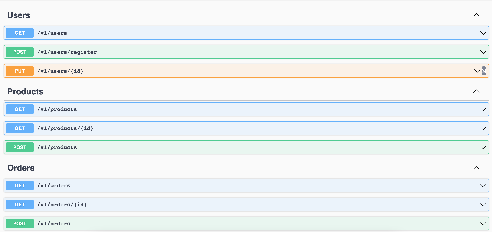

## Restful API in Java/SpringBoot

## OpenAPI document

- [OpenAPI doc](http://localhost:8080/v3/api-docs)

- [Swagger UI](http://localhost:8080/swagger-ui/index.html)
  - 
  - missing `/auth/login` in Swagger: login to get JWT token

## How to run

Run all the tests
```bash
auto/test
```

Run the application locally:
```bash
auto/dev
```

Run one specific test:
```bash
./gradlew test --test my.playground.user.UserControllerTest
```

### Tech Stack

- [x] Java 17
- [x] SpringBoot 3 (Spring 6)
- [x] Spring Security
- [x] Flyway
- [x] JWT
- [x] Dockerise
- [x] OpenAPI 3
- [x] TestContainers for integration tests
- [x] PostgreSQL

### TODO

- [ ] introduce VAVR and refactor in a functional programming way
- [ ] encrypt the database secret
- [ ] support GraphQL
- [ ] API: aggregate
